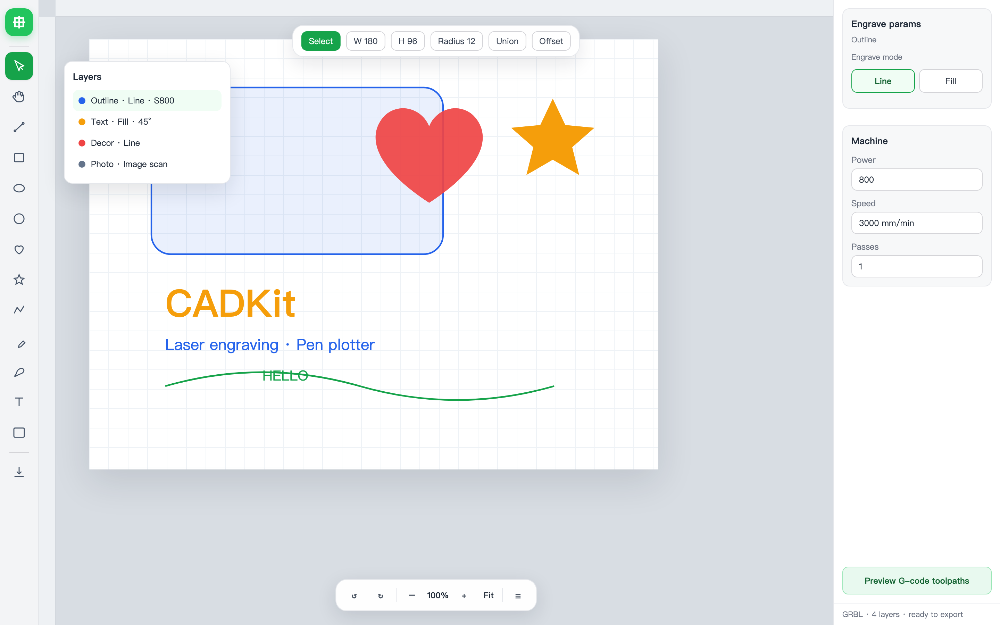
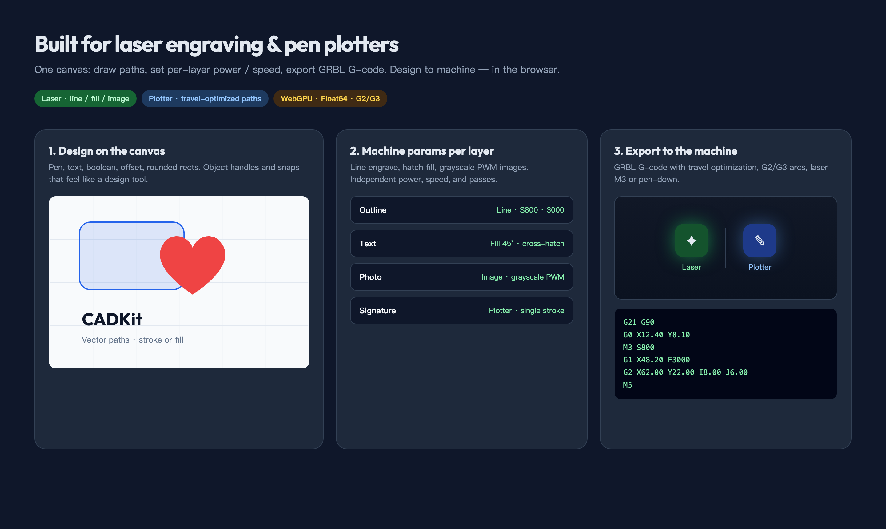

<p align="center">
  <h1 align="center">CADKit</h1>
  <p align="center">
    <a href="https://github.com/tetap/cadkit/stargazers"></a>
    <a href="./LICENSE"></a>
    <a href="https://www.typescriptlang.org/"></a>
    <a href="https://gpuweb.github.io/gpuweb/"></a>
    
    
  </p>
  <p align="center">
    <a href="./README.md"><b>English</b></a> ·
    <a href="./README.zh-CN.md">简体中文</a> ·
    <a href="./README.ja.md">日本語</a> ·
    <a href="./README.ko.md">한국어</a>
  </p>
  <p align="center">
    <b>Laser engraving and pen-plotter software for the web.</b><br />
    Draw on a CAD canvas, set per-layer power · speed · passes, export GRBL G-code — from design to the machine in the browser.
  </p>
</p>

<p align="center">
  <a href="https://tetap.github.io/cadkit/">
    
  </a>
</p>

<p align="center">
  <a href="https://tetap.github.io/cadkit/"><b>Live Playground →</b></a>
  &nbsp;·&nbsp;
  <a href="#quick-start">Quick start</a>
  &nbsp;·&nbsp;
  <a href="https://github.com/tetap/cadkit/tree/main/apps/docs">Docs</a>
</p>

---

## Why CADKit

Most web canvases stop at drawing. CADKit is built for **diode / GRBL lasers** and **pen plotters**: the same document you edit is the job you cut, engrave, or write.

| Advantage | What you get |
|-----------|----------------|
| **Laser-ready layers** | Line, fill (hatch / cross-hatch), and image scan — each with power, speed, and passes |
| **Photo engraving** | Grayscale PWM, threshold, or Floyd–Steinberg → G-code `S` values |
| **Plotter-friendly paths** | Travel optimization, path welding, single-stroke writing without extra jumps |
| **True arcs** | Circles and fitted curves export as **G2 / G3**, not a cloud of G1 chords |
| **Design-tool UX** | Pen, rounded rects, boolean, offset, arc text, visible snaps — not a CAM form |
| **WebGPU + Float64** | GPU canvas at CAD precision; no Canvas2D as the primary renderer |
| **Open in the browser** | No install. Embed `@cadkit/editor` or use the Playground as a desktop shell |

---

## Designed for the job

One flow: **design → layer machine params → GRBL out**.

<p align="center">
  
</p>

- **Line** — outline engraving / cutting / pen stroke  
- **Fill** — bidirectional or cross-hatch scan at a chosen angle  
- **Image** — raster scan; travel only on transparency  
- **Export** — optimized order, `M3` / `M5` laser words, G0 travel, G1 / G2 / G3 motion  

[I/O guide →](./apps/docs/guide/io.md)

---

## Features

### WebGPU infinite canvas

Vector and image passes on a modern GPU path — pan, zoom, and edit without a Canvas2D primary renderer.

[Docs →](./apps/docs/guide/rendering.md)

### CAD-grade document

Float64 authority model, layers, groups, compound paths with holes, and undo / redo you can trust.

[Docs →](./apps/docs/guide/concepts.md)

### Editor UX that gets out of the way

Object-mode transforms, parametric handles (rect / star / corner radius), arc text, rulers, grid, align & angle snap.

[Docs →](./apps/docs/guide/interaction.md)

### Boolean, offset & path edit

Union / subtract / intersect / exclude; contour offset (including groups); vertex select & delete in path edit mode.

### Layers built for fabrication

Per-layer line / fill / image modes, GRBL-oriented power · speed · passes, hatch preview, drag-to-reorder stack.

### Import what you have, export what you cut

SVG · DXF · G-code · raster images in; SVG · JSON · G-code out — path welding on import, travel optimization on export.

**Also in the box:**

- **Image layers** — Rasters land on dedicated image layers; vector and image stacks stay isolated.
- **Curve text** — Arc / path text with on-canvas radius handles.
- **Snaps with feedback** — Align, grid, and angle snap with visible guides.
- **Spatial pipeline** — R-tree / BVH, display-list cache, LOD, incremental WebGPU updates.
- **Playground** — Full desktop editor UI (zh-CN / en-US) before you embed the stack.
- **And more** — APIs are early (`v0.1`); the [commit history](https://github.com/tetap/cadkit/commits/main) is the living changelog.

---

## Stack at a glance

Works as a **TypeScript monorepo** — pick packages, or start from the editor facade.

| Layer | Packages |
|-------|----------|
| **Public API** | `@cadkit/editor` · `@cadkit/types` |
| **Model** | `@cadkit/document` · `@cadkit/commands` · `@cadkit/geometry` |
| **View** | `@cadkit/scene` · `@cadkit/render-webgpu` · `@cadkit/guides` |
| **Input** | `@cadkit/interaction` · `@cadkit/text` |
| **I/O** | `@cadkit/io-svg` · `@cadkit/io-dxf` · `@cadkit/io-gcode` · `@cadkit/assets` |

Inspired by incremental / dirty-region ideas from [LeaferJS](https://github.com/leaferjs/leafer-ui) and approachable object / handle APIs from [Fabric.js](https://fabricjs.com/) — purpose-built for laser, plotter, and CAD-scale workflows.

---

## Quick start

```bash
# Node >= 20, pnpm 10+
pnpm install
pnpm build
pnpm playground:dev    # full desktop editor
pnpm docs:dev          # VitePress docs
```

```ts
import { createEditor } from '@cadkit/editor'

const editor = await createEditor({ view: canvas, theme: 'light' })
await editor.import.svg(svgText)
await editor.import.dxf(dxfFile)
await editor.import.gcode(gcodeText)
const nc = await editor.export.gcode()
```

Open the [Playground](https://tetap.github.io/cadkit/), draw a path, set the layer to line or fill, then export G-code for your laser or plotter.

---

## Repository layout

```
apps/
  docs/          VitePress documentation
  playground/    Full desktop editor (Dev: stress / seed / benches)
packages/
  editor/        Public facade (`createEditor`)
  document/      Float64 model + layers (+ gcode / image modes)
  geometry/      Matrices, curves, boolean, offset, shapes, import weld
  interaction/   Tools, selection, snaps, handles, text overlay
  scene/         Document → cacheable display list
  render-webgpu/ WebGPU vectors + images
  io-svg/        SVG import / export
  io-dxf/        Streaming DXF
  io-gcode/      G-code import / export + hatch + path order
  …              types, spatial, commands, assets, text, guides, wasm
```

---

## Performance targets (v1)

| Scenario | Target |
|----------|--------|
| Tens of millions of entities | Chunked load, bounded memory |
| ~1M simple visible entities | ~60 FPS high-end · ~30 FPS iGPU |
| Navigation frame time | p95 ≤ 16.7 ms (high-end) · ≤ 33 ms (iGPU) |
| Pure pan geometry upload | &lt; 1 KB/frame (`pan-reuse`) |
| Click / local-edit feedback | p95 ≤ 100 ms |

Dense splines, fills, and massive text are not promised at full detail for 1M on-screen entities — LOD and real benches apply.

---

## Developing

```bash
pnpm install && pnpm build && pnpm test
```

1. Keep changes focused; respect package boundaries  
2. Add or update tests for geometry, document, and interaction  
3. Open a PR with a clear summary and test plan  

Issues and ideas: [github.com/tetap/cadkit](https://github.com/tetap/cadkit).

---

## License

CADKit is free and open source under the [MIT License](./LICENSE).
