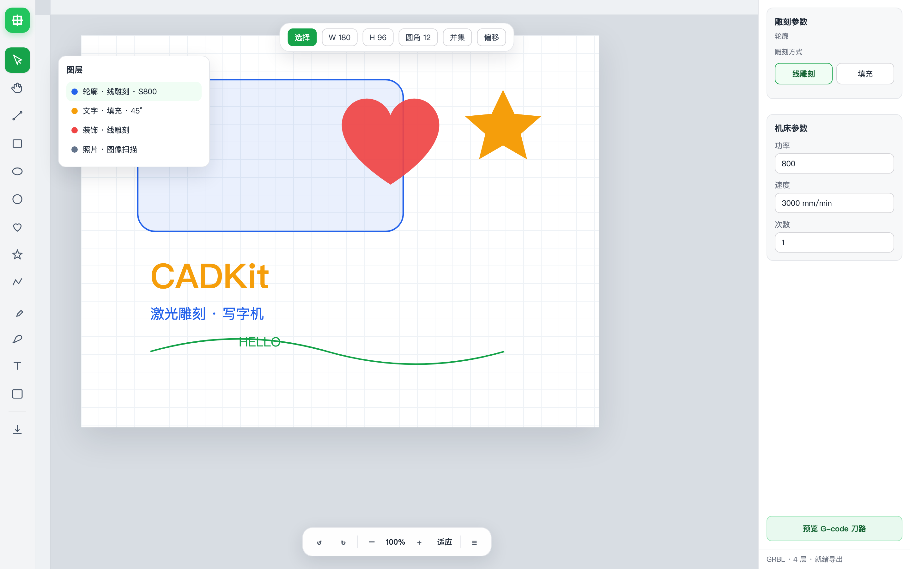

<p align="center">
  <h1 align="center">CADKit</h1>
  <p align="center">
    <a href="https://github.com/tetap/cadkit/stargazers"></a>
    <a href="./LICENSE"></a>
    <a href="https://www.typescriptlang.org/"></a>
    <a href="https://gpuweb.github.io/gpuweb/"></a>
    
    
  </p>
  <p align="center">
    <a href="./README.md">English</a> ·
    <a href="./README.zh-CN.md"><b>简体中文</b></a> ·
    <a href="./README.ja.md">日本語</a> ·
    <a href="./README.ko.md">한국어</a>
  </p>
  <p align="center">
    <b>面向激光雕刻与写字机的 Web 软件。</b><br />
    在 CAD 画布上设计，按图层设功率 · 速度 · 次数，导出 GRBL G-code —— 浏览器里完成从设计到下机。
  </p>
</p>

<p align="center">
  <a href="https://tetap.github.io/cadkit/">
    
  </a>
</p>

<p align="center">
  <a href="https://tetap.github.io/cadkit/"><b>在线 Playground →</b></a>
  &nbsp;·&nbsp;
  <a href="#快速开始">快速开始</a>
  &nbsp;·&nbsp;
  <a href="https://github.com/tetap/cadkit/tree/main/apps/docs">文档</a>
</p>

---

## 为什么是 CADKit

多数 Web 画布只负责「画」。CADKit 是为 **二极管 / GRBL 激光** 和 **写字机（笔式绘图仪）** 做的：你编辑的文档，就是要切、雕、写的那份活。

| 优势 | 你得到什么 |
|------|------------|
| **为加工准备的图层** | 线雕刻、填充（双向 / 交叉）、图像扫描 —— 每层独立功率、速度、次数 |
| **照片雕刻** | 灰度 PWM、阈值、Floyd 抖动 → G-code 的 `S` 功率 |
| **写字机友好路径** | 空走优化、碎线焊接，签名 / 单笔连续少跳刀 |
| **真圆弧** | 圆与拟合曲线导出 **G2 / G3**，不是一堆 G1 折线 |
| **设计工具级交互** | 钢笔、圆角矩形、布尔、偏移、弧形文字、看得见的吸附 |
| **WebGPU + Float64** | GPU 画布、CAD 精度；不以 Canvas2D 做主渲染 |
| **浏览器即用** | 免安装。可嵌入 `@cadkit/editor`，也可用 Playground 当桌面壳 |

---

## 软件设计

一条链路：**画布设计 → 图层机床参数 → 导出 GRBL**。

<p align="center">
  
</p>

- **线雕刻** — 轮廓切割 / 描边 / 落笔写字  
- **填充** — 双向或交叉扫描，可设角度  
- **图像** — 光栅扫描；仅透明处空走  
- **导出** — 刀路排序、`M3` / `M5`、G0 空走、G1 / G2 / G3 运动  

[I/O 文档 →](./apps/docs/guide/io.md)

---

## 功能亮点

### WebGPU 无限画布

向量与图片通道走现代 GPU 路径 —— 平移、缩放、编辑，不以 Canvas2D 作为主渲染器。

[文档 →](./apps/docs/guide/rendering.md)

### CAD 级文档模型

Float64 权威模型、图层、编组、带孔复合路径，以及可靠的撤销 / 重做。

[文档 →](./apps/docs/guide/concepts.md)

### 顺手的编辑器体验

对象模式变换、参数化图形手柄（矩形 / 星形 / 圆角）、弧形文字、标尺网格、对齐与角度吸附。

[文档 →](./apps/docs/guide/interaction.md)

### 布尔、偏移与路径编辑

并 / 差 / 交 / 异或；轮廓偏移（含编组展开）；路径编辑模式下点选与删点。

### 为加工准备的图层

图层线雕刻 / 填充 / 图像模式，功率 · 速度 · 次数，填充预览，拖拽排序。

### 有什么导什么，切什么出什么

SVG · DXF · G-code · 光栅图导入；SVG · JSON · G-code 导出 —— 导入焊接碎线、导出优化空走。

**另外还有：**

- **图像图层** — 导入图片落到独立图像层，与矢量层互不混拖。
- **曲线文字** — 圆弧 / 路径文字，画布半径手柄常驻。
- **看得见的吸附** — 对象对齐、网格、角度吸附带辅助线。
- **空间管线** — R-tree / BVH、显示列表缓存、LOD、WebGPU 增量更新。
- **Playground** — 完整桌面编辑器壳（zh-CN / en-US），嵌入前可先试用。
- **持续迭代** — 早期 API（`v0.1`）；[提交历史](https://github.com/tetap/cadkit/commits/main)即活的变更记录。

---

## 技术栈一览

TypeScript **monorepo** —— 可按包取用，也可从编辑器门面起步。

| 层 | 包 |
|----|----|
| **公共 API** | `@cadkit/editor` · `@cadkit/types` |
| **模型** | `@cadkit/document` · `@cadkit/commands` · `@cadkit/geometry` |
| **视图** | `@cadkit/scene` · `@cadkit/render-webgpu` · `@cadkit/guides` |
| **交互** | `@cadkit/interaction` · `@cadkit/text` |
| **I/O** | `@cadkit/io-svg` · `@cadkit/io-dxf` · `@cadkit/io-gcode` · `@cadkit/assets` |

吸收 [LeaferJS](https://github.com/leaferjs/leafer-ui) 的增量 / 脏区思路，以及 [Fabric.js](https://fabricjs.com/) 易用的对象与控制柄 API —— 面向激光、写字机与 CAD 规模重做。

---

## 快速开始

```bash
# Node >= 20，pnpm 10+
pnpm install
pnpm build
pnpm playground:dev    # 完整桌面编辑器
pnpm docs:dev          # VitePress 文档
```

```ts
import { createEditor } from '@cadkit/editor'

const editor = await createEditor({ view: canvas, theme: 'light' })
await editor.import.svg(svgText)
await editor.import.dxf(dxfFile)
await editor.import.gcode(gcodeText)
const nc = await editor.export.gcode()
```

打开 [Playground](https://tetap.github.io/cadkit/)：画路径、把图层设成线雕刻或填充，再导出给激光或写字机的 G-code。

---

## 仓库结构

```
apps/
  docs/          VitePress 文档
  playground/    完整桌面编辑器（Dev：压测 / 种子 / 基准）
packages/
  editor/        公共门面（`createEditor`）
  document/      Float64 模型 + 图层（含 gcode / 图像模式）
  geometry/      矩阵、曲线、布尔、偏移、图形、导入焊接
  interaction/   工具、选择、吸附、手柄、文字浮层
  scene/         文档 → 可缓存显示列表
  render-webgpu/ WebGPU 向量 + 图片
  io-svg/        SVG 导入 / 导出
  io-dxf/        流式 DXF
  io-gcode/      G-code 导入 / 导出 + 填充 + 刀路顺序
  …              types、spatial、commands、assets、text、guides、wasm
```

---

## 性能目标（首版）

| 场景 | 目标 |
|------|------|
| 千万级总实体 | 分块加载，有界内存 |
| 约百万简单可见实体 | 高端 ~60 FPS · 核显 ~30 FPS |
| 导航帧耗时 | 高端 p95 ≤ 16.7 ms · 核显 ≤ 33 ms |
| 纯平移 geometry upload | &lt; 1 KB/frame（`pan-reuse`） |
| 点击 / 局部编辑反馈 | p95 ≤ 100 ms |

复杂样条、填充与海量文本不承诺百万级全细节同屏，须经 LOD 与真实基准限定。

---

## 参与开发

```bash
pnpm install && pnpm build && pnpm test
```

1. 变更保持聚焦，尊重包边界  
2. 为 geometry、document、interaction 补充或更新测试  
3. PR 写清摘要与测试计划  

Issue 与想法：[github.com/tetap/cadkit](https://github.com/tetap/cadkit)。

---

## 许可证

CADKit 以 [MIT License](./LICENSE) 开源。
