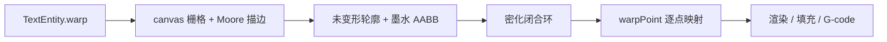

# 文字变形

Photoshop / xTool 式包络变形：8 种预设（扇形、下弧形、上弧形、拱形、凸出形、贝壳、花冠、波浪形），加上方向、变形强度、水平透视、垂直透视。变形作用在**字形轮廓**上，预览、填充、G-code、SVG 走同一条路径。

源码：`packages/geometry/src/text-warp.ts`，轮廓挂钩：`packages/geometry/src/text-outlines.ts`。

## 管线



1. 先按布局（直线或圆弧）抽出未变形轮廓，缓存 key **不含** `warp`，平移时不必重栅格。
2. 用全部轮廓点算墨水 AABB，作为包络的参考框。
3. 闭合环按框尺寸密化，避免大弧/大波时边被拉成折线。
4. 每个点经 `warpPoint` 映射；`bend = distortH = distortV = 0` 视为恒等，直接跳过。

Playground：选中文字 → ContextBar **变形** → 写入 `TextEntity.warp`。滑条 -100%…100% 对应字段 `[-1, 1]`。

## 数据

```ts
interface TextWarp {
  style: TextWarpStyle          // arc | arcLower | arcUpper | arch | bulge | shell | flag | wave
  direction?: 'horizontal' | 'vertical'
  bend: number                  // 变形强度 [-1, 1]
  distortH?: number             // 水平透视 [-1, 1]
  distortV?: number             // 垂直透视 [-1, 1]
}
```

## 坐标系

编辑器是 **Y 向下**。包络公式在以墨水框中心为原点的 **Y 向上** 局部系里算，再折回编辑器。

$$
\begin{aligned}
u &= (x - c_x) / \mathrm{halfW} \in [-1, 1] \\
v &= -(y - c_y) / \mathrm{halfH} \in [-1, 1]
\end{aligned}
$$

`direction === 'vertical'` 时先交换 $(u, v)$，映射后再换回来，同一套公式兼顾竖排。

## 核心：`warpPoint`

对框内一点：

1. 归一化到 $(u, v)$。
2. `styleEnvelope(style, u, v, bend, halfW, halfH, hd, vd)` 得到局部 $(o_x, o_y)$（Y 向上、世界单位）。
3. **花冠 / 波浪** 在包络里消化透视；其余样式事后做**基线锚定**梯形：

$$
o_y' = \mathrm{bot}(u) + \bigl(o_y - \mathrm{bot}(u)\bigr) \cdot \max(0.42,\ 1 + h_d \cdot u \cdot 0.82)
$$

   水平透视从列底往上长高，而不是绕中心缩放整段 $Y$（后者会把宽字串挤成山峰）。垂直透视：$o_x' = o_x \cdot (1 + v_d \cdot v)$。
4. 折回编辑器：$(c_x + o_x,\ c_y - o_y)$。

## 花冠（`flag`）

对照参考图：50% 是旗面波；100% + 水平 100% + 垂直 -18% 是中右拔高、顶收尖、右端拖尾。

**冠波**（两端 0、中间 1）：

$$
w(u) = \cos(u \cdot \pi / 2)
$$

**强度缓入**：50% 保持参考幅度；超过 50% 不再线性加倍，避免斜率过陡把相邻字形抹成三角。

$$
b' =
\begin{cases}
b & |b| \le 0.5 \\
\mathrm{sign}(b)\bigl(0.5 + 0.42(|b|-0.5)\bigr) & |b| > 0.5
\end{cases}
$$

**幅度跟字高走，宽度封顶**。未封顶的 $k \cdot \mathrm{halfW}$ 会让长数字串在 100% + 水平透视时变成一座山：

$$
A = b' \bigl(1.85\,\mathrm{halfH} + 0.4 \cdot \min(\mathrm{halfW},\ 5.5\,\mathrm{halfH})\bigr)
$$

**上下沿同一相位，上沿走得更多**（中间字变高），水平透视加强 $+u$ 侧冠波，并从**列底**长高：

$$
\begin{aligned}
w_H &= w(u)\cdot(1 + h_d \cdot u \cdot 0.45) \\
\mathrm{bot} &= -\mathrm{halfH} + 0.42 A\, w_H \\
\mathrm{rawTop} &= \mathrm{halfH} + 1.38 A\, w_H \\
h &= \max(0.62,\ 1 + h_d \cdot u \cdot 0.7) \\
\mathrm{top} &= \mathrm{bot} + (\mathrm{rawTop}-\mathrm{bot})\, h \\
o_y &= \mathrm{lerp}(\mathrm{bot},\ \mathrm{top},\ (v+1)/2)
\end{aligned}
$$

$w(u)$ 在两端仍为 0，最右端不会被水平透视顶成最高点，对应参考图最后那个「3」的扁尾巴。

**切变**（竖画随坡度倾斜）：

$$
o_x = u\cdot\mathrm{halfW}\cdot\max(0.35,\ 1 + v_d\cdot v\cdot 1.6) + b'\cdot 0.38\cdot\mathrm{halfH}\cdot\bigl(-\sin(u\pi/2)\bigr)\cdot v
$$

垂直透视为负时，底-右侧再往右泄一点，拉出拖尾。切变保持温和，避免把左侧「1」抹成一条斜线。

## 其它预设

| 样式 | 算法要点 |
|------|----------|
| 扇形 `arc` | 世界空间圆弧，弦长 = 行宽、矢高 $\propto \max(\mathrm{halfH},\ \mathrm{halfW})$，按列半径插值，不先压成正方形（宽字串不会被压扁）。 |
| 下/上弧形 | 只弯底边或顶边，另一边保持平直，列向 lerp。 |
| 拱形 `arch` | 整列加 $A\cdot\cos(u\pi/2)$，高度几乎不变。 |
| 凸出形 `bulge` | 中间列 $Y$ 乘 $1 + b\cdot w(u)$。 |
| 贝壳 `shell` | 上宽下收 + 顶部抛物抬升。 |
| 波浪形 `wave` | 与花冠相同包络，两周期 $\sin((u+1)\pi)$，幅度更小。 |

扇形半径：

$$
R = \frac{\mathrm{halfW}^2 + s^2}{2|s|},\quad
\theta = u\cdot\arctan(\mathrm{halfW}/(R-|s|)),\quad
r = \mathrm{sign}(s)\,R + \ell_y
$$

## 密化

闭合环按 $\max(0.25,\ \min(\mathrm{width},\mathrm{height})/36)$ 插点，单边最多 32 段。开环不密化。

## 文件

| 路径 | 职责 |
|------|------|
| `packages/types/src/entities.ts` | `TextWarp` / `TextWarpStyle` |
| `packages/geometry/src/text-warp.ts` | 包络与透视 |
| `packages/geometry/src/text-outlines.ts` | 栅格轮廓后挂钩 |
| `apps/playground/src/ui/TextWarpDialog.ts` | 变形面板 |

测例：`packages/geometry/src/text-warp.test.ts`（恒等、扇形上拱、花冠中高、水平透视右峰、左端不被压扁）。
